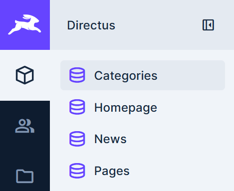
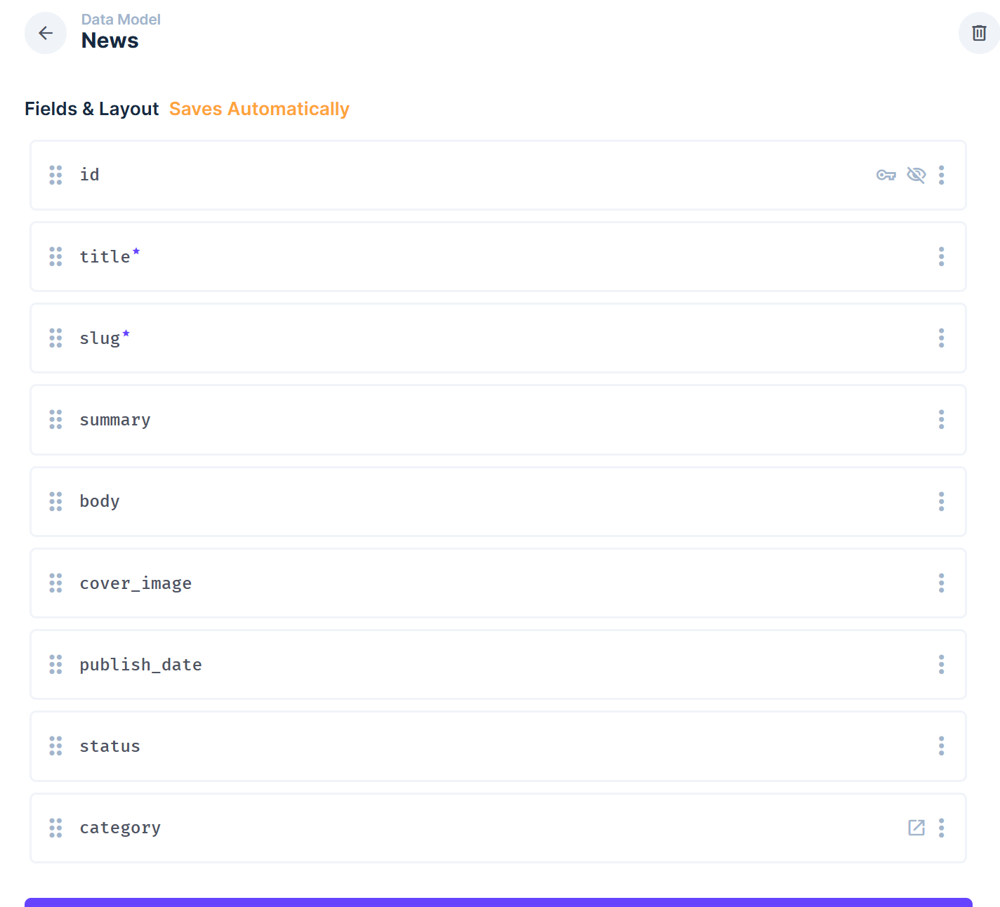
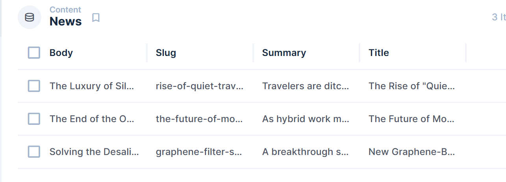
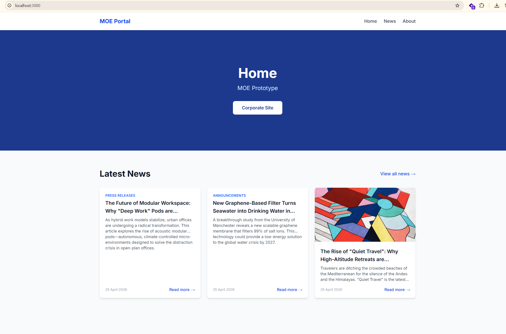
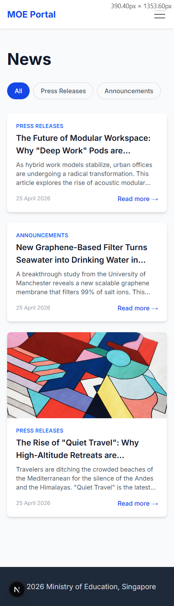
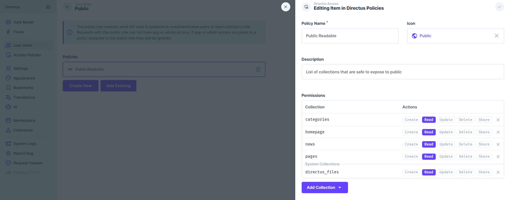

## CMS Setup Screenshots
Collections Sidebar

Schema Configuration

Sample Data

## Application Screenshots
Homepage

Mobile View - News Listing Page

## Getting Started

  1. Install dependencies
  npm install

  2. Set up environment variables

  cp .env.example .env.local
  No changes needed — the default values already point to localhost:8055.

  3. Start Directus + PostgreSQL

  docker compose up -d
  Wait ~30 seconds, then open http://localhost:8055 and log in with:
  - Email: admin@example.com
  - Password: admin123

  4. Import the CMS schema
    a. In Directus, go to Settings → Data Model
    b. Click the Import Schema button (top right)
    c. Upload schema-snapshot.json from the project root
    d. Click Yes, run it

  This creates all collections (news, categories, pages, homepage) automatically.

  ▎ Note: You will still need to add sample content manually via Content in the sidebar before the app displays any
  ▎ data.

  5. Set public read permissions
    a. Go to Settings → Roles → Public
    b. Create a policy that grants Read access to: categories, news, pages, homepage, directus_files
    

  6. Start the Next.js app

  npm run dev
  Open http://localhost:3000.

